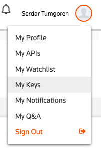

# OpenCalais Entity Extraction

## Overview

The [Python script in this directory](calais_example.py) demonstrates how to call the [OpenCalais API][] to perform [entity extraction][]. The example uses a paragraph of text from an FDA medical device [recall announcement][].


## Obtain an API Key

Before using this code, you must [register for an API key][].

Once you've registered for an API key, log in to your new Reuters/Refinitiv account at <https://developers.refinitiv.com/>.

Once you're logged in, you can obtain your API key by clicking on the user settings in the upper right and selecting `My Keys`.



Copy the long string of characters next to `Your Key`.

Next, create the below shell environment variables by [exporting them](../../docs/using_env_vars_for_secrets.md) in `~/.bash_profile` and *substituting your information*:

> Note, use the email that you registered with for the OpenCalais service.

```
# ~/.bash_profile
export OPENCALAIS_API_USER="USERNAME@email_address.com"
export OPENCALAIS_API_KEY="YOUR_API_KEY"
```

The script is a simplified version of this [code](http://www.opencalais.com/python-code-sample/).

## Additional Resources

* [OpenCalais Demo][]
* [A Practical Approach to Understanding and Ingesting TRIT Output for Your Use Case][]


[OpenCalais API]: https://developers.refinitiv.com/open-permid/intelligent-tagging-restful-api
[entity extraction]: https://en.wikipedia.org/wiki/Named-entity_recognition
[exporting them]: ../../docs/python/using_env_vars_for_secrets.md
[OpenCalais Demo]: https://permid.org/onecalaisViewer
[recall announcement]: https://www.fda.gov/MedicalDevices/Safety/ListofRecalls/ucm630614.htm
[register for an API key]: https://iamui.thomsonreuters.com/iamui/UI/createUser?app_id=Bold&realm=Bold&realm=Bold
[A Practical Approach to Understanding and Ingesting TRIT Output for Your Use Case]: https://developers.thomsonreuters.com/article/practical-approach-understanding-and-ingesting-trit-output-your-use-case
